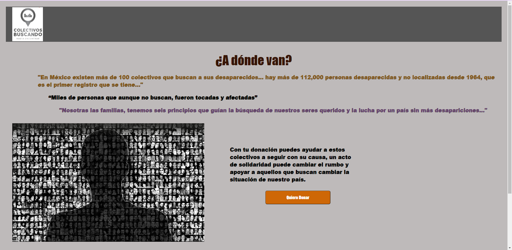
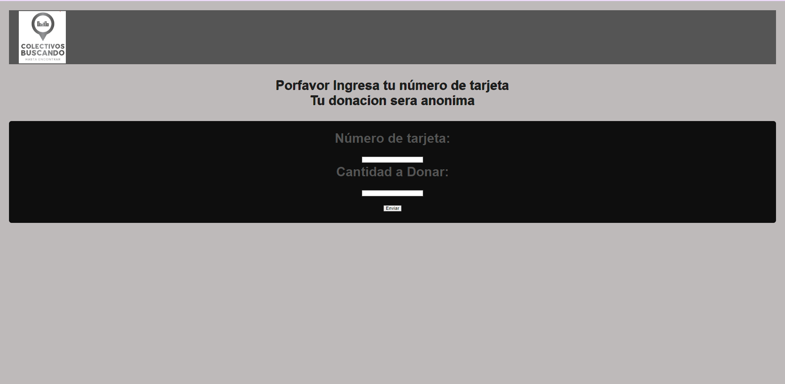
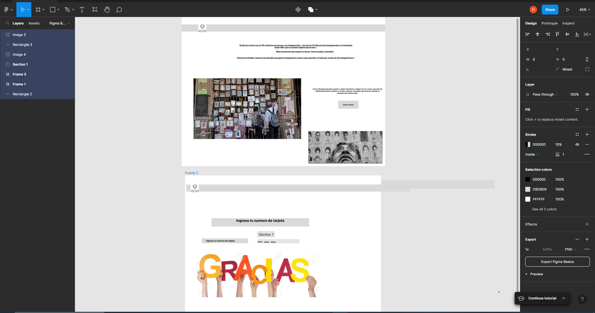

# Página de Donación para Colectivos de Personas Desaparecidas en México

## Índice

* [1. Introduccion](#1-Introduccion)
* [2. Resumen del proyecto](#2-resumen-del-proyecto)
* [3. Consideraciones generales](#3-consideraciones-generales)
* [4. Hito: Criterios de aceptación mínimos del proyecto](#4-hito-criterios-de-aceptación-mínimos-del-proyecto)
* [5. Hito Opcional: Mostrar la franquicia de tarjeta](#5-hito-opcional-mostrar-la-franquicia-de-tarjeta)
* [6. Consideraciones técnicas](#6-consideraciones-técnicas)
* [7. Objetivos de aprendizaje](#7-objetivos-de-aprendizaje)
* [8. Pistas, tips y lecturas complementarias](#8-pistas-tips-y-lecturas-complementarias)
* [9. Para considerar Project Feedback](#9-para-considerar-project-feedback)

***

## 1. Introduccion

Esta es una página diseñada para donar a colectivos de personas que buscan a individuos desaparecidos en México. El objetivo de esta página es crear conciencia y unirnos en la lucha contra las desapariciones en el país, permitiendo a los usuarios realizar donaciones mediante el ingreso de su número de tarjeta y la cantidad a donar.

## 2. Usuarios Principales del Producto

Los principales usuarios de este producto son:

* Personas interesadas en apoyar la búsqueda de personas desaparecidas en México.
* Familiares y amigos de personas desaparecidas que buscan apoyo para continuar con las labores de búsqueda.
* Ciudadanos comprometidos con la causa de las desapariciones en México.

### Objetivos de los Usuarios

Los usuarios de esta página tienen los siguientes objetivos en relación con el producto:

* Contribuir con donaciones para financiar las actividades de los colectivos de búsqueda de personas desaparecidas.
* Generar conciencia sobre el problema de las desapariciones en México.
* Unirse a la lucha contra las desapariciones y mostrar solidaridad hacia las familias afectadas.

## 3. Solución Proporcionada por el Producto

El producto que estamos creando resuelve los problemas de los usuarios de la siguiente manera:

* Facilita la donación a los colectivos de búsqueda de personas desaparecidas a través de un proceso sencillo y seguro.
* Proporciona información relevante sobre el problema de las desapariciones en México, generando conciencia en los usuarios.
* Permite que los usuarios se unan a la lucha contra las desapariciones mediante su participación activa y donaciones.
* Garantiza la privacidad y anonimato de las donaciones al no solicitar información personal adicional aparte del número de tarjeta.

Con este producto, esperamos lograr una mayor participación y apoyo de la sociedad en la búsqueda de personas desaparecidas en México, fomentando la solidaridad y la conciencia colectiva sobre este grave problema.

## 4. Descripción de la Funcionalidad y Decisiones de Diseño

La funcionalidad principal del producto es permitir a los usuarios realizar donaciones de forma segura y sencilla, contribuyendo así a los colectivos de búsqueda de personas desaparecidas. La página cuenta con un formulario donde los usuarios pueden ingresar su número de tarjeta y la cantidad a donar.

En cuanto al diseño, se ha utilizado una paleta de colores sobrios y serios para transmitir la gravedad del problema. Se ha evitado el uso de elementos gráficos llamativos para enfocar la atención en el contenido y la causa que se busca apoyar. El estilo de periódico se ha seleccionado para transmitir una sensación de seriedad y urgencia.

Se ha buscado mantener un diseño sencillo y minimalista para facilitar la navegación y la comprensión de la página. La información se presenta de manera clara y concisa, con el objetivo de generar conciencia y motivar a los usuarios a realizar donaciones.

 

## Mi Experiencia en Este Proyecto

Durante el desarrollo de este proyecto, me enfoqué en encontrar un tema de interés general que tuviera una causa significativa. Elegir la problemática de las desapariciones en México me permitió involucrarme en un tema sensible y de importancia social.

Para implementar la funcionalidad de validación de tarjetas, utilicé diferentes recursos y herramientas. Utilicé Trello para organizar mis avances y guardar paso a paso los cambios y decisiones que tomaba durante el desarrollo del proyecto. Esta herramienta resultó muy útil para mantener un registro claro de mis progresos.

Además, utilicé Figma para diseñar un prototipo de alta fidelidad. Con esta herramienta, pude visualizar y representar de manera precisa la interfaz de la página de donación. Me aseguré de mantener un diseño serio, sencillo y seguro, transmitiendo respeto hacia el tema y generando confianza en el usuario.

